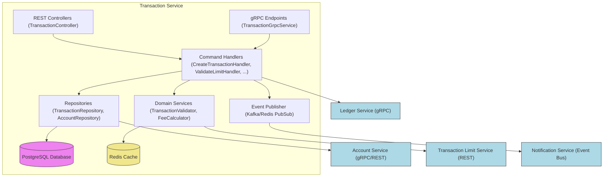

# Transaction Service – Component Diagram

```mermaid
flowchart TB
    subgraph TransactionService [Transaction Service]
        API["REST Controllers (TransactionController)"]
        gRPC["gRPC Endpoints (TransactionGrpcService)"]

        CMD["Command Handlers (CreateTransactionHandler, ValidateLimitHandler, ...)"]
        REPO["Repositories (TransactionRepository, AccountRepository)"]
        SVC["Domain Services (TransactionValidator, FeeCalculator)"]
        EVT["Event Publisher (Kafka/Redis PubSub)"]

        DB[("PostgreSQL Database")]
        CACHE[("Redis Cache")]
    end

    %% Flow
    API --> CMD
    gRPC --> CMD
    CMD --> SVC
    CMD --> REPO
    CMD --> EVT
    REPO --> DB
    SVC --> CACHE

    %% External dependencies
    REPO --> AS["Account Service (gRPC/REST)"]
    SVC --> ALS["Transaction Limit Service (REST)"]
    CMD --> LS["Ledger Service (gRPC)"]
    EVT --> NS["Notification Service (Event Bus)"]
    
    %% Styles
    classDef db fill:violet,stroke:#333333,stroke-width:1px;
    classDef cache fill:khaki,stroke:#333333,stroke-width:1px;
    classDef ext fill:lightblue,stroke:#333333,stroke-width:1px;
    class DB db
    class CACHE cache
    class AS,ALS,LS,NS ext
```