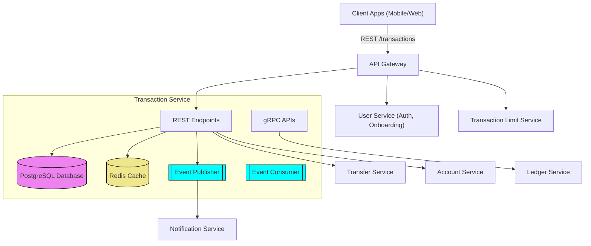

# Transaction Service – Container Diagram

```mermaid
flowchart TB
    Client["Client Apps (Mobile/Web)"] -->|REST /transactions| APIGW["API Gateway"]

    APIGW --> TSREST["Transaction Service REST API"]
    APIGW --> US["User Service (Auth, Onboarding)"]
    APIGW --> ALS["Transaction Limit Service"]

    subgraph TransactionService [Transaction Service]
        TSREST["REST Endpoints"]
        TSgRPC["gRPC APIs"]
        TSPG[("PostgreSQL Database")]
        TSCache[("Redis Cache")]
        TSQPub[["Event Publisher"]]
        TSQSub[["Event Consumer"]]
    end

    %% Internal Links
    TSREST --> TSPG
    TSREST --> TSCache
    TSREST --> TSQPub

    %% External Services
    TSgRPC --> LS["Ledger Service"]
    TSQPub --> NS["Notification Service"]

    %% Transfer & Accounts
    TSREST --> TRS["Transfer Service"]
    TSREST --> AS["Account Service"]

    classDef db fill:violet,stroke:black,stroke-width:1px;
    classDef cache fill:khaki,stroke:black,stroke-width:1px;
    classDef queue fill:aqua,stroke:black,stroke-width:1px;
    class TSPG db
    class TSCache cache
    class TSQPub,TSQSub queue
```