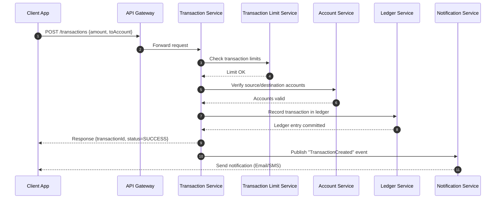

## 🔄 Transaction Flow – Sequence Diagram (`sequence.md`)

# Transaction Service – Sequence Diagram
### Scenario: Customer initiates a transfer via Mobile App

```mermaid
sequenceDiagram
    autonumber

    participant Client as Client App
    participant APIGW as API Gateway
    participant TS as Transaction Service
    participant ALS as Transaction Limit Service
    participant AS as Account Service
    participant LS as Ledger Service
    participant NS as Notification Service

    Client->>APIGW: POST /transactions {amount, toAccount}
    APIGW->>TS: Forward request

    TS->>ALS: Check transaction limits
    ALS-->>TS: Limit OK

    TS->>AS: Verify source/destination accounts
    AS-->>TS: Accounts valid

    TS->>LS: Record transaction in ledger
    LS-->>TS: Ledger entry committed

    TS-->>Client: Response {transactionId, status=SUCCESS}

    TS->>NS: Publish "TransactionCreated" event
    NS-->>Client: Send notification (Email/SMS)
```